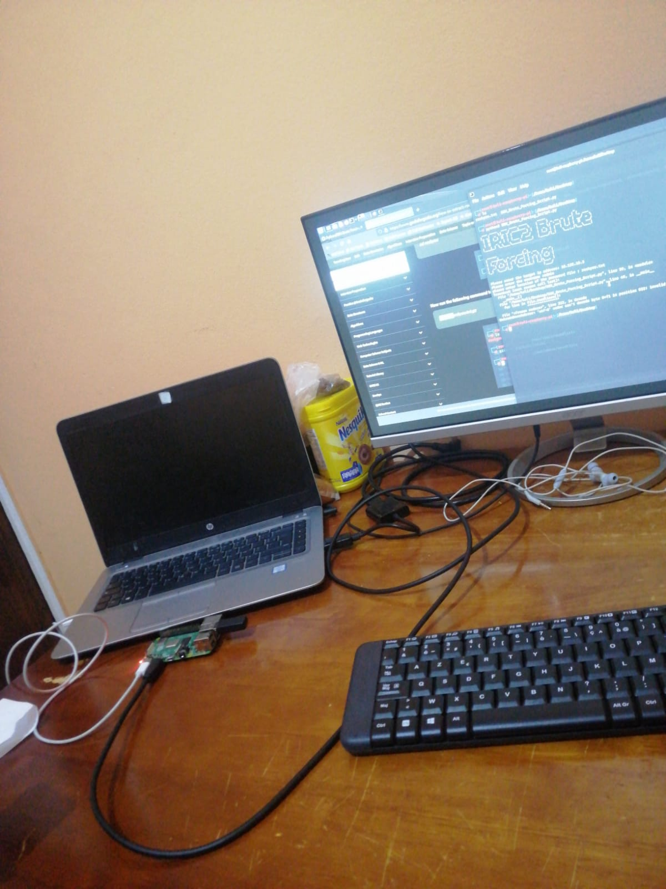
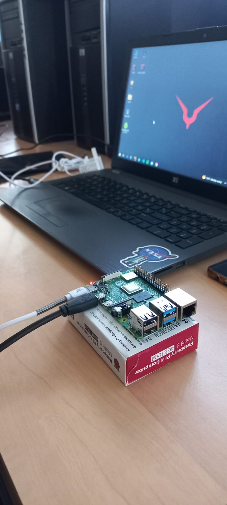
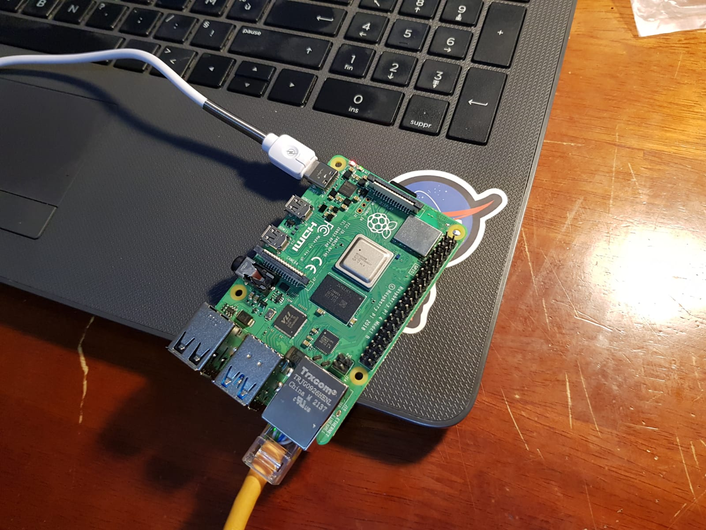
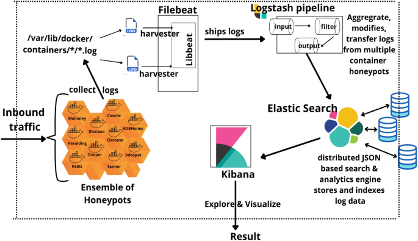
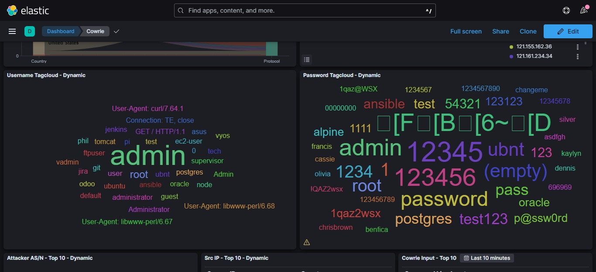
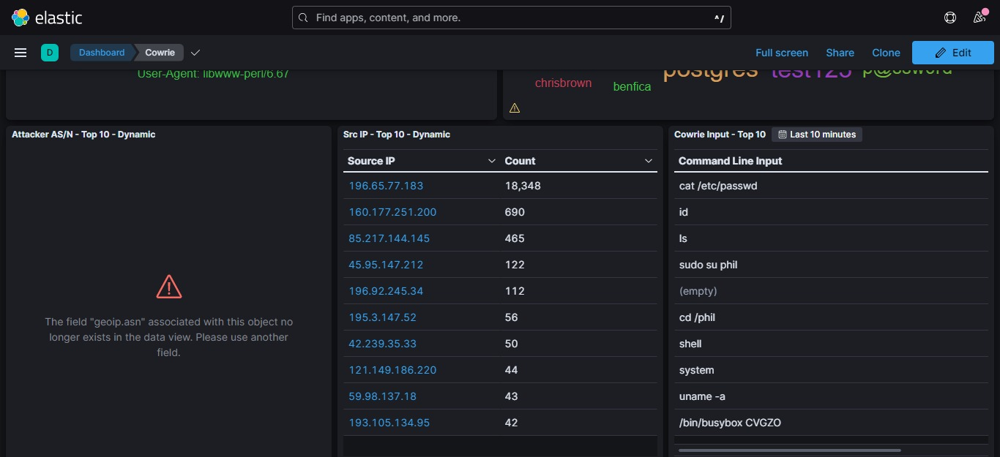
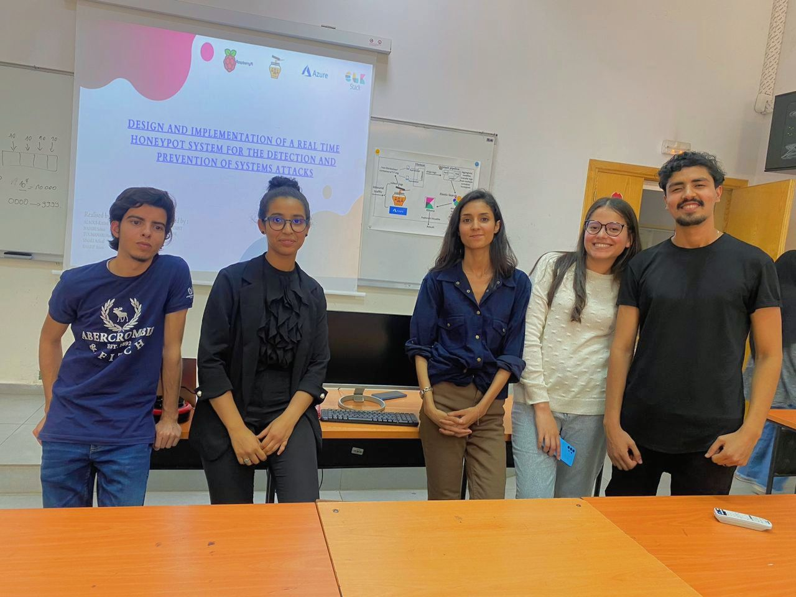
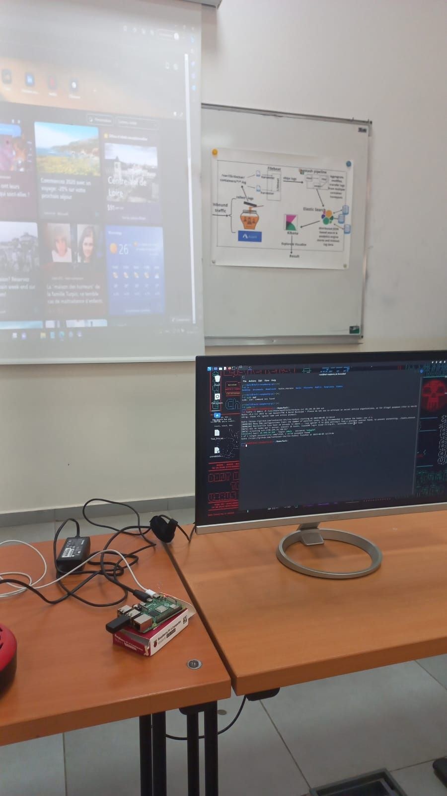

> # Project1/HoneyPot
 Implementation of a Real Time Honeypot System for the Detection and Prevention of Systems Attacks
> ### [Project Report](https://github.com/HANATM/Project1-Real-Time-Honeypot-System-for-the-Detection-and-Prevention-of-System-Attacks/blob/main/Report) 

<h1 center="align">Project laboratory (behind the scenes)</h1>

  
   
    

 <h1 center="align">Project architecture </h1>

   
  <h3 center="align">Printed architecture </h3>
  

  

<h1 center="align">Project Components </h1>

- [**Elastic Stack**](https://github.com/HANATM/Project1-Real-Time-Honeypot-System-for-the-Detection-and-Prevention-of-System-Attacks/tree/main/ELK%20stack)   : The Elastic Stack is a group of open source products from Elastic designed to help users take data from any type of source and in any format, and search, analyze and visualize that data in real time. 
-Elasticsearch for storing events .  
-Logstash  is a data collection engine that unifies data from multiple sources and  sends event to Elasticsearch.  
-Kibana for displaying events dashboards.  

- [**NGINX**](https://github.com/HANATM/Project1-Real-Time-Honeypot-System-for-the-Detection-and-Prevention-of-System-Attacks/tree/main/Ngnix%20) , Nginix provides secure remote access (reverse proxy) to Kibana 

- [**ATTACK MAP**](https://github.com/HANATM/Project1-Real-Time-Honeypot-System-for-the-Detection-and-Prevention-of-System-Attacks/blob/main/Attack%20map ) to visualize alll the attacks that are been launched on our system .

- [**Cowrie HoneyPot**](https://github.com/HANATM/Project1-Real-Time-Honeypot-System-for-the-Detection-and-Prevention-of-System-Attacks/tree/main/Cowrie%20HoneyPot) : Cowrie is an  SSH  honeypot designed to log brute force attacks and shell interaction performed by an attacker. Cowrie also functions as an SSH and telnet proxy to observe attacker behavior to another system.

- [**Host : Microsoft Azure**](https://github.com/HANATM/Project1-Real-Time-Honeypot-System-for-the-Detection-and-Prevention-of-System-Attacks/tree/main/Microsoft%20Azure) 
[Docker] :  is an open platform for developing, shipping, and running applications. Docker enables you to separate your applications from your infrastructure so you can deliver software quickly.

<h1 center="align">Kibana Dashboard Visualization </h1>

  
  

<h1 center="align">Shots from Our project presentation , 05/06/2023 , ENSA KHOURIBGA  </h1>

  
  
  

